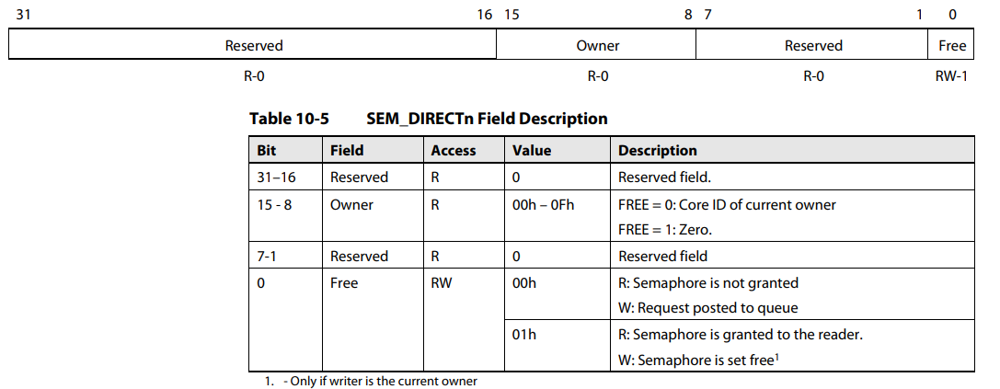
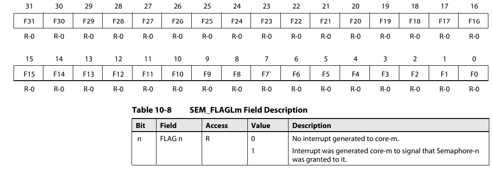
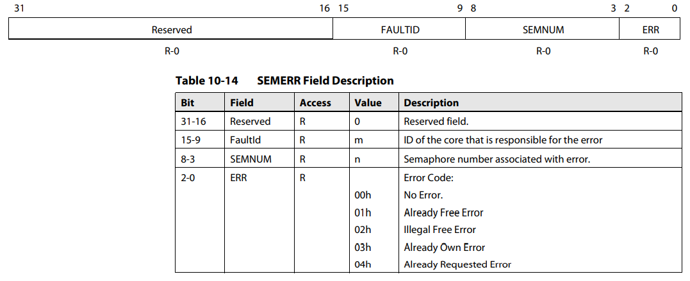

# This is the Software support, some drivers of the HSEM will be putted here.

## HSEM function overview

1. Three kinds of regs: resource regs, interrupt&error regs and task regs.

2. write 1'b0 to the lowest bit of the HSEM means release the resource, write 1'b1 to the lowest bit of the HSEM means lock the resource.

3. ==IMPORTANT== This module provide a atomic operation supported by hardware, when a core need a resource, it will write 0x1 to the lowest bit of the sem_x and send the core_id to the [15:8] bits of the sem_x. And any operation of the other core will **invalid**(not allowed) and lead to **error**.

## REG LIST:

1. **sem_x** (0<=x<=7), every source has its own reg.
   
2. **sem_status_x** (0<=x<=1), every core has its own status reg.
   
3. **error_x** (0<=x<=1), every core has its own error status reg.
   
4. **interrput_x** (0<=x<=1), every core has its own interrupt status reg.

-   This reg can be set in two ways: error incurred or software set.
-   The behavior of this kind of regs is: read this reg will return the real value of the interrupt status.

5. **interrupt_clear_x** (0<=x<=1), these two reg is fake, but when addressing these regs and read one of them, the interrupt reg will be cleared soon, and the return value will be 32'b0;

6. **error_clear_x** (0<=x<=1),these two reg is fake, but when addressing these regs and read one of them, the error reg will be cleared soon, and the return value will be 32'b0;

7. **task_status**, this reg will save the task code, it will allow that one core can inform the other core to do the next task. **_BUT THE TASK CODE HAS TO BE SET IN THE SOFTWARE!!!_**

## Driver introduction

1. CORE_0_ID = 8'b10101010 CORE_0_ID = 8'b01010101
2. **_Reg need to be modified later!!!!_**
